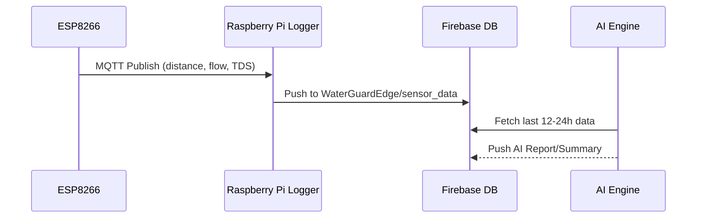
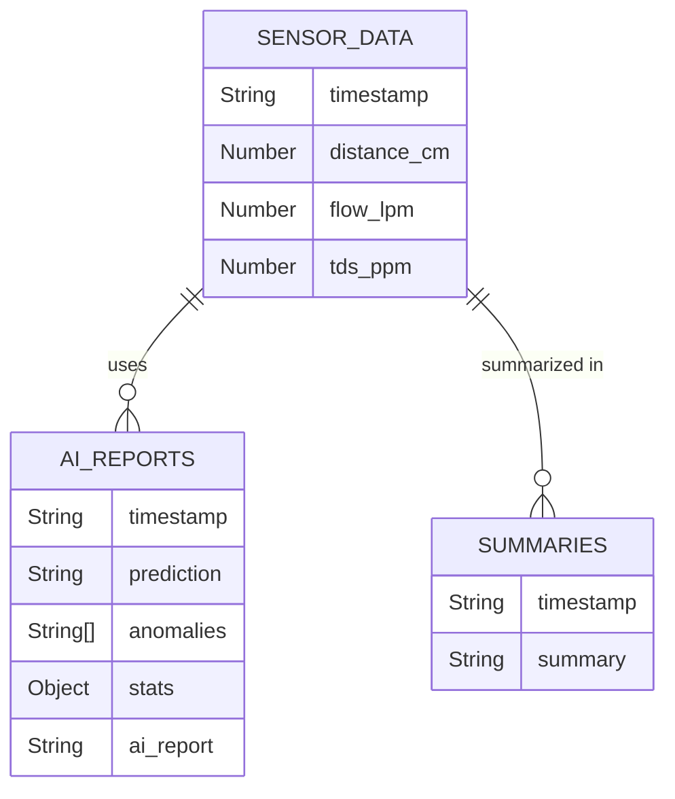

# WaterGuardEdge 🛡️  
A Smart IoT Water Monitoring, Analysis & AI Reasoning System

WaterGuardEdge is an integrated IoT project for real-time water usage, quality, and tank level monitoring. It combines microcontroller-based sensing, MQTT telemetry, cloud logging (Firebase), traditional ML analysis, and advanced LLM-powered (TinyLlama) reporting. This system helps households and facilities monitor water consumption, detect anomalies, and receive actionable AI insights.

---

## System Overview

WaterGuardEdge consists of hardware components (ESP8266, sensors), edge logging (Raspberry Pi), data streaming/logging, and advanced analytics via AI/LLM modules.

---

# Folder Structure

| Folder/File                  | Description                                    |
|------------------------------|------------------------------------------------|
| `ai_engine/`                 | AI/ML analysis and LLM-based reasoning scripts |
| `data_logger/`               | MQTT logger, Firebase connectors               |
| `sensor_readers/`            | Local sensor drivers (e.g., ultrasonic)        |
| `esp.ino`                    | Microcontroller firmware (ESP8266)             |
| `database.py`                | *(Not used/reserved)*                          |

---

# Hardware Stack

- **ESP8266** with:
  - Ultrasonic sensor (water level)
  - Flow sensor (YF-S401)
  - TDS (water quality)
- **Raspberry Pi** or Linux machine as MQTT/Firebase logger
- **Firebase Realtime Database** for cloud storage

---

# Data Flow Pipeline

1. **Sensing:** ESP8266 gathers water level, flow, and TDS.
2. **Transmission:** ESP8266 sends telemetry via MQTT.
3. **Logging:** Raspberry Pi receives MQTT messages and logs to Firebase.
4. **Analysis:** AI engine (ML + LLM) fetches data, analyzes, reports, and uploads insights.

---

# Detailed Component Documentation

---

## ai_engine/ai_agent.py

This is the main orchestrator for the AI pipeline. It connects the ML analyzer, advanced LLM-based reasoning, and cloud reporting.

### Responsibilities

- Initializes Firebase (safe singleton pattern).
- Runs ML-based anomaly detection and prediction.
- Invokes LLM (TinyLlama) to produce human-readable reports.
- Uploads the final AI summary report to Firebase.

### Main Pipeline Steps

1. **Run ML Analyzer:** Detect anomalies and predict tank state.
2. **Format Data:** Ensure timestamps are ISO-8601 strings.
3. **Run LLM Reasoner:** Use TinyLlama to generate insights and suggestions.
4. **Upload Report:** Push the report to Firebase under `ai_reports`.
5. **Print Report:** Output to console for debugging.

```python
def run_ai_pipeline():
    # [1] Run ML analyzer
    ml_output = run_analyzer()
    if ml_output is None:
        return
    # [2] Format timestamps
    for entry in ml_output["raw"]:
        if "timestamp" in entry and hasattr(entry["timestamp"], "isoformat"):
            entry["timestamp"] = entry["timestamp"].isoformat()
    # [3] Generate LLM-based report
    final_report = llm_reason(...)
    # [4] Upload to Firebase
    ref.push({
        "timestamp": ...,
        "prediction": ...,
        "anomalies": ...,
        "stats": ...,
        "ai_report": final_report
    })
```

---

## ai_engine/llm_reasoner.py

This file wraps the TinyLlama model as an expert report generator. It prepares a detailed prompt incorporating prediction, anomalies, statistics, and raw data, then calls TinyLlama via the `ollama` CLI.

### Key Features

- Summarizes and explains ML findings.
- Suggests causes, actionable advice, and confidence levels.
- Uses subprocess to run inference.

```python
def llm_reason(prediction, anomalies, stats, last24h):
    prompt = f"""
    ... # Constructed prompt with all context
    """
    result = subprocess.run(
        ["ollama", "run", "tinyllama", prompt],
        capture_output=True, text=True
    )
    return result.stdout.strip() if result.returncode == 0 else "[LLM Error] " + result.stderr
```

---

## ai_engine/tinyllama_summarizer.py

A standalone script for summarizing the last 24 hours of telemetry data with TinyLlama.

### Workflow

- **Fetches**: Reads last 24h from Firebase.
- **Prompts**: Asks TinyLlama to generate a daily summary.
- **Uploads**: Stores summary in `summaries` node in Firebase.

### Highlights

- Handles missing/no data gracefully.
- Customizable prompt for water-specific insights.

```python
def summarize(data):
    prompt = (
        "Generate a detailed but concise daily water system summary. "
        "Data fields: distance_cm (water level), flow_lpm (usage), "
        "tds_ppm (water quality). Identify: tank fills, usage patterns, leaks, "
        "water quality warnings, and anomalies.\n\n"
        f"Here is the last 24h data in JSON:\n\n{json.dumps(data, indent=2)}\n\n"
        "Now give the final summary:"
    )
    result = subprocess.run(["ollama", "run", "tinyllama", prompt], ...)
```

---

## ai_engine/analyzer.py

This is the core machine learning/analytics engine. It performs:

- **Data Fetch:** Loads recent telemetry (default: last 12 hours) from Firebase.
- **Prediction:** Uses linear regression to predict tank emptying time.
- **Anomaly Detection:** Flags sudden changes, stuck sensors, abnormally fast usage.
- **Statistical Trends:** Computes averages, min/max, number of samples.

### Example ML Prediction Logic

```python
def predict_empty_time(df, empty_cm=5):
    if len(df) < 4:
        return "Not enough data to predict."
    ...
    if slope >= 0:
        return "Tank is filling or stable, not emptying."
    t_empty = (empty_cm - intercept) / slope
    secs_remaining = t_empty - df["t"].iloc[-1]
    ...
    return f"Tank will reach {empty_cm} cm in approx {minutes:.1f} minutes."
```

#### Anomaly Detection Techniques:

- **Sudden jumps in level:** Sensor glitch or error.
- **Abnormal emptying rate:** Possible leak or overuse.
- **Flatline:** Sensor failure.

---

## data_logger/mqtt_logger_firebase.py

A simple MQTT-to-Firebase bridge. Receives telemetry data from ESP8266 and stores it in Firebase.

- **MQTT Broker:** Listens on topic `water/telemetry`.
- **On Message:** Parses JSON, extracts fields (`distance_cm`, `flow_lpm`, `tds_ppm`).
- **Stores**: Pushes data with timestamp to `WaterGuardEdge/sensor_data`.

```python
def on_message(client, userdata, msg):
    data = json.loads(msg.payload.decode())
    ref = db.reference("WaterGuardEdge/sensor_data")
    ref.push({
        "timestamp": datetime.now().isoformat(),
        "distance_cm": distance,
        "flow_lpm": flow,
        "tds_ppm": tds
    })
```

---

## sensor_readers/ultrasonic_reader.py

Directly interfaces with an ultrasonic sensor using Raspberry Pi GPIO.

### Features

- **Measures water level** using trigger/echo timing.
- **Main loop**: Prints distance every second.
- **Graceful exit**: Cleans up GPIO on `KeyboardInterrupt`.

```python
def get_distance():
    # Send trigger pulse, wait for echo, calculate duration
    distance = pulse_duration * 17150
    return round(distance, 2)
```

---

## esp.ino

The microcontroller firmware for ESP8266, written in Arduino C++.

### Functionality

- **Connects to WiFi & MQTT**
- **Reads sensors:**
  - Ultrasonic distance for tank level
  - Flow rate sensor (YF-S401)
  - (TDS analog input defined, not sent)
- **Publishes JSON payload** (distance, flow) to MQTT topic every 5 seconds.

#### Core Loop

```cpp
void loop() {
    if (!client.connected()) reconnect();
    client.loop();
    if (now - lastSend > 5000) {
        lastSend = now;
        float dist = getDistance();
        float flow = getFlowRate(5000);
        String payload = "{\"distance_cm\":";
        payload += dist;
        payload += ",\"flow_lpm\":";
        payload += flow;
        payload += "}";
        client.publish("water/telemetry", payload.c_str());
    }
}
```

---

## database.py

This file is currently empty and reserved for future use, such as for abstracting database connectors or schema management.

---

# Key Data Flows



---

# Database Structure



---

# Example API Interactions

While this project uses Firebase Realtime Database and MQTT, here’s how a REST-style API might look for some operations:

```api
{
    "title": "Upload Sensor Data",
    "description": "Push telemetry data from logger to Firebase.",
    "method": "POST",
    "baseUrl": "https://watermarker-4e0e7-default-rtdb.asia-southeast1.firebasedatabase.app",
    "endpoint": "/WaterGuardEdge/sensor_data.json",
    "headers": [],
    "queryParams": [],
    "pathParams": [],
    "bodyType": "json",
    "requestBody": "{\n  \"timestamp\": \"2024-06-01T12:00:00Z\",\n  \"distance_cm\": 30.5,\n  \"flow_lpm\": 2.1,\n  \"tds_ppm\": 120\n}",
    "responses": {
        "200": {
            "description": "Success",
            "body": "{ \"name\": \"uniqueFirebaseKey\" }"
        }
    }
}
```

```api
{
    "title": "Upload AI Report",
    "description": "Store AI-generated summary and analysis in Firebase.",
    "method": "POST",
    "baseUrl": "https://watermarker-4e0e7-default-rtdb.asia-southeast1.firebasedatabase.app",
    "endpoint": "/WaterGuardEdge/ai_reports.json",
    "headers": [],
    "queryParams": [],
    "pathParams": [],
    "bodyType": "json",
    "requestBody": "{\n  \"timestamp\": \"2024-06-01T12:00:00Z\",\n  \"prediction\": \"Tank will reach 5cm in 45 minutes.\",\n  \"anomalies\": [\"Sudden spikes detected\"],\n  \"stats\": {\"avg_level\": 25.4, ...},\n  \"ai_report\": \"LLM-generated text report...\"\n}",
    "responses": {
        "200": {
            "description": "Success",
            "body": "{ \"name\": \"uniqueFirebaseKey\" }"
        }
    }
}
```

---

# Key Concepts & Recommendations

```card
{
    "title": "Data Quality Matters",
    "content": "Clean, consistent sensor data ensures accurate predictions and actionable AI reports."
}
```

```card
{
    "title": "LLM Custom Prompts",
    "content": "Craft prompts with clear instructions for TinyLlama to get the most expert, actionable summaries."
}
```

---

# Getting Started

1. **Flash** `esp.ino` to ESP8266, set up sensors.
2. **Run** `mqtt_logger_firebase.py` on Raspberry Pi or compatible device.
3. **(Optional)** Run `ultrasonic_reader.py` for direct sensor testing.
4. **Run** AI analytics and summary tools in `ai_engine/`.

---

# Troubleshooting & Tips

- **Firebase/Google credentials:** Ensure `firebase-credentials.json` is valid and paths are correct.
- **MQTT broker:** Must be accessible from both ESP8266 and Raspberry Pi.
- **Time sync:** All devices should be on UTC for consistent logs and reasoning.
- **LLM model:** Requires `ollama` CLI and TinyLlama model installed.

---

# License

MIT License (add your copyright)

---

# Contributing

Pull requests and issue reports welcome! Please open issues for bugs, new features, or documentation improvements.

---

# Authors

- WaterGuardEdge Team / [Your Name Here]

---

# Summary

WaterGuardEdge bridges low-cost hardware, robust cloud infrastructure, and advanced AI reasoning to provide water management insights for smart homes and facilities. Its modular architecture makes it extendable to new sensors, analytics, and AI models.

---

*Monitor, Analyze, and Act – for a smarter, safer, and more efficient water future.* 🚰✨
